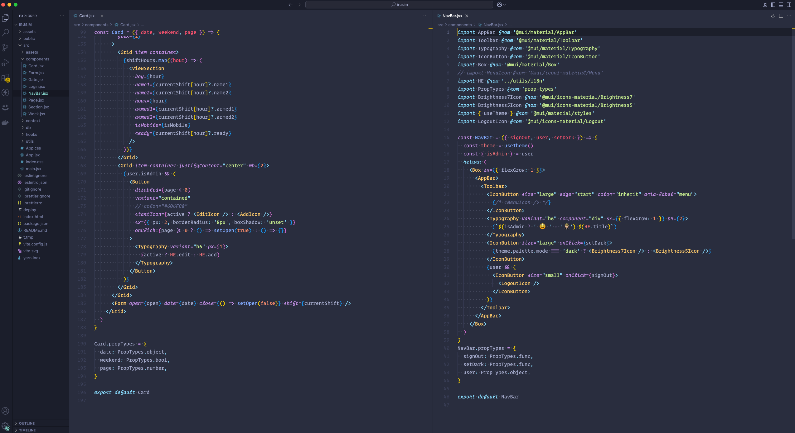

# 🌑 Dark Beauty - A Material Design-Inspired Theme

Welcome to **Dark Beauty** — a sleek, modern, and immersive theme inspired by Google's Material Design, tailored for lovers of dark aesthetics and beautiful interfaces.

## ✨ Features

- 🌗 **Material Design-Inspired** — Elegant elevation, smooth surfaces, and clear visual hierarchy.
- 🎨 **Beautifully Dark** — A refined color palette of charcoal blacks, deep grays, and vibrant accents.
- 💡 **Eye Comfort** — Carefully tuned for low-light environments to reduce eye strain.
- ⚡ **High Contrast & Readability** — Crisp syntax highlighting with thoughtful contrast and focus indicators.
- 🧠 **Minimal, Yet Expressive** — Balanced UI elements that stay out of the way while keeping things stylish.

## 📸 Preview

> _A glimpse of the dark side..._

  
_(Don't forget to add your own screenshot!)_

## 🛠️ Installation

1. Clone or download this repo.
2. Install the theme following the steps for your environment (e.g., editor, IDE, or app).
3. Activate **Dark Beauty** from your appearance or theme settings.
4. Enjoy the view 😎

## ⚙️ Customization

Want to tweak the colors or add your own flair? Go ahead! The theme is fully editable. Just follow the structure in the theme files and modify the colors to match your vibe.

## 🤝 Contributing

Have a suggestion, bug fix, or cool idea? Feel free to open an issue or submit a pull request. Let's make Dark Beauty even more stunning together.

## 📄 License

MIT — do what you want, just don't sell it without credit.  
Design is love. Share it. 💜

---

> _"Darkness is not the absence of color — it's where beauty finds its contrast."_  
> — You (probably)
